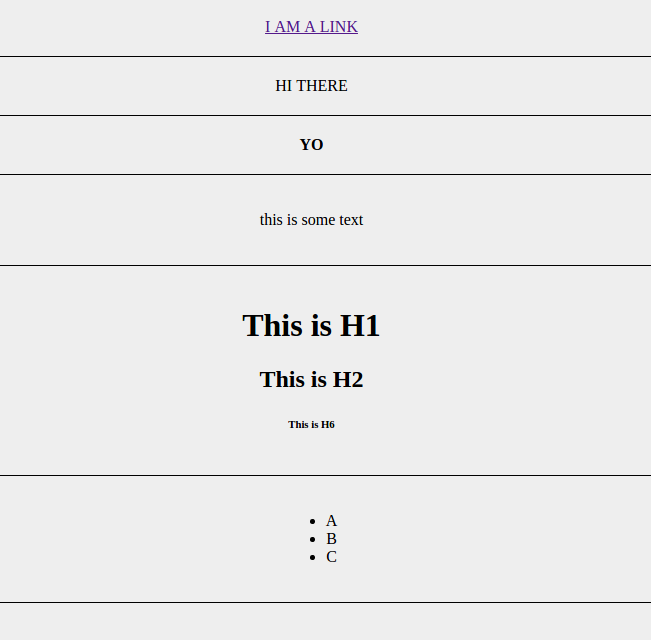

Task 001
=============

# Before
1. cd C:\Users\Tina\Desktop\tina
2. http-server
3. http://localhost:8080/task_001

# Topics Covered
- Making a simple index.html
- Building Block DOM Elements
- Special Elements

# Lesson
A website is composed of various files which tell your browser to do things.  By things, we mean listen for mouse events, key strokes, render boxes, apply colors to those boxes, make requests across the internet, etc.  Typically, there is a **index.html** which acts as the glue to all of those various files.

In this lesson, we will only need to make changes to the **index.html**.

Open the index.html file and look over the characters and words.  Notice that there are *tags*.  Here is a list of some of the possible HTML tags.

```html
<html></html>
<head></head>
<title></title>
<title></title>
<body></body>
<div></div>
<a></a>
<h1></h1>
<h2></h2>
<h3></h3>
<h4></h4>
<h5></h5>
<h6></h6>
<b></b>
<span></span>
<ul></ul>
<li></li>
<script></script>
<link></link>
```

The format of how these tags are nested is called XML.  The actual tags are called HTML tags.  Basically, just know that HTML tags can wrap other HTML tags, like a **sandwich**.  

There is the top bun and bottom bun, or

There is a **opening tag** and a **closing tag**.  Closing tags contain the `/` character, as seen in `</html>`.

The browser knows how to read those tags and do things with them.  

Each tag has a specific purpose, but honestly, the **most important** one you need to really understand is `<div></div>`.  The `<div>` tag is used for dividing up your page into sections.  It is for the layout.  Through CSS (covered in the next lesson) and Javascript (a much later lesson), you can build up practically whatever you want using only `<div>` tags.

## The `DIV` Tag
As mentioned, the div tag divides you page up into sections.  It defines the layout.  `<div>` are, by default, stacked on top of each other.  So, if you include the following in your index.html

```html
<div>a</div>
<div>b</div>
<div>c</div>
```

the browser should render 3 rows, each containing a, b, c, in that order.  

Remember, HTML tags wrap other tags, so if you want to include something inside the row, let's say a link, you can easily do so like so:

```html
<div>
  <a href="http://facebook.com"></a>
</div>
```

With the information given, try to complete the task below.  

Note, the **most important** part of software is to **become a master of finding the answer**.  

We don't have the mental capacity to memorize everything we see, so instead, make lists, notes, documentation.  Device tools which help you quickly look up that exact tag you want and what it does without having to ask someone a question or using google.

If you don't know the answer, use google or ask the questions.  But remember, if you find yourself asking the same question more than once or if you find yourself stuck on something you have once solved in the past, you need to rethink your software development process.

Only memorize the things you need frequently.  For the other things, write it down and get organized.

# Task
- Create a page with 6 rows
  - Row 1
    - Must contain a link `<a>` tag with text "I AM A LINK" which, when clicked, redirects to http://google.com
  - Row 2
    - Must contain a `<span>` tag with text that say "HI THERE"
  - Row 3
    - Must contain bold text using the `<b>` tag
  - Row 4
    - Must contain a `<p>` tag containing some text
  - Row 5
    - Must contain `<h1>`, `<h2>`, `<h6>`, tags all with some text inside them
  - Row 6
    - Must contain a list of items using `<ul>` and `<li>`

# Expected Outcome
The following is an image of what your page should look like (it doesn't have to be exact)



# Tips
- You should only be adding code to between the "ADD CHANGES HERE" comments
- Google is your friend
- My solution is found in the "solution" folder
###lesson
