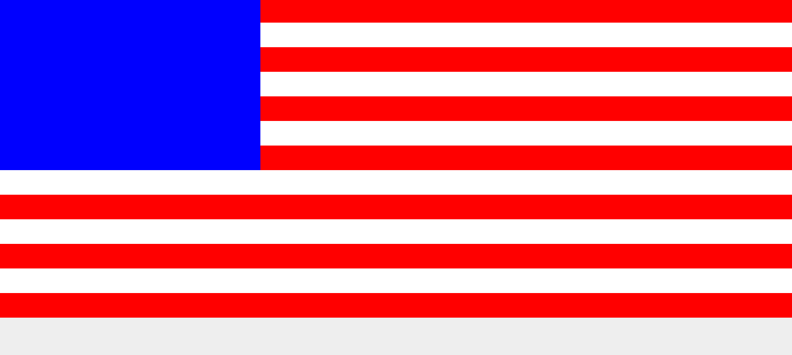

Task 001
=============

# Before
1. cd C:\Users\Tina\Desktop\tina
2. http-server
3. http://localhost:8080/task_002

# Topics Covered
- Applying styles of DOM elements

# Lesson
We just learned about HTML tags and how we can use them, more specifically the DIV tag, for creating the layout of your website.  In this lesson we are going to learn about how to apply styles of the HTML elements using CSS.

**CSS** (cascading style sheets) is the term used for the code that "styles" your DOM elements.  For instance, if we want to make one of those rows we created red, or maybe even 200px in height, we can easily do so by adding a style to the DOM elements.

Typically, we put styles in an external file.  In this lesson, the current **index.html** file has a reference to load the **style.css** file which is located in the css directory.  The **full path** to the file is **css/styles.css**.

Let's say we wanted to make an american flag.  

First off, think of what we need.  We need:
- 7 red rows
- 6 white rows
- a blue box

Now, how would we do this... well, we know how to make 13 rows, so let's go ahead and do what we know.

**13 rows:**
```html
<div></div>
<div></div>
<div></div>
<div></div>
<div></div>
<div></div>
<div></div>
<div></div>
<div></div>
<div></div>
<div></div>
<div></div>
<div></div>
```

Now, how do we style them?  We will use CSS.  

CSS looks through your elements and apply styles to them depending on different attributes.  The attributes you will need to care about in this lesson are:

- class
- id

What do we mean by attributes?  An attribute is something attached to a dom element. For instance, the following is a div with an attribute class set to red.

```html
<div class='red'></div>
```
Here is one with white!
```html
<div class='white'></div>
```
Here is one with blue!
```html
<div class='blue'></div>
```

Cool, so what does that really mean?  Well, it means we have a way to label our rows with different attributes so that the CSS can find the ones we want red and make them red.

Let's add the proper attributes to the 13 rows:
```html
<div class='red'></div>
<div class='white'></div>
<div class='red'></div>
<div class='white'></div>
<div class='red'></div>
<div class='white'></div>
<div class='red'></div>
<div class='white'></div>
<div class='red'></div>
<div class='white'></div>
<div class='red'></div>
<div class='white'></div>
<div class='red'></div>
```

Awesome, make sense so far right?  Now we just need to create some styles in our CSS to tell the browser how to style those elements:

Remember, this will be added into the **css/styles.css** file.
```css
.red {
  background-color: red;
}

.white {
  background-color: white;
}
```

Note that the **.** in front of the style name represents the **class** attribute.

Now, if you refresh that in your browser, you probably won't see anything.  This is because the rows have no height.  By default, an empty DIV contains no height, just a width of 100%.  What this means is we need to add some height to all of our rows of our flag.

We can easily do this using CSS:

```css
div {
  height: 50px;
}

.red {
  background-color: red;
}

.white {
  background-color: white;
}
```

Your flag should start looking like something.

The last part is a little bit more complicated.  How do we draw a blue box that is about 7 rows in height and about 1/3 the width of the flag?  Well, it turns out we have the following **width** style we can apply.

Well, lets do what we know.  We know we need another DIV to make our blue box right, so let's add that to our index.html.  This time, let's use the id attribute.

```html
<div id='blue'></div>
<div class='red'></div>
<div class='white'></div>
<div class='red'></div>
<div class='white'></div>
<div class='red'></div>
<div class='white'></div>
<div class='red'></div>
<div class='white'></div>
<div class='red'></div>
<div class='white'></div>
<div class='red'></div>
<div class='white'></div>
<div class='red'></div>
```
and we can style it blue,
we can give it a height of 7 * 50px = 350px, and we can give it a width of 33%.
```css
div {
  height: 50px;
}

#blue {
  background-color: blue;
  height: 350px;
  width: 33%;
}

.red {
  background-color: red;
}

.white {
  background-color: white;
}
```

Note that we used **#** for specifying the id attribute in the style.css file.

Now we almost have the flag!  You should notice at this point that the blue box is above everything with white space to the right of it.  This is because a DIV is a row, and they stack on top of each other.  To change the blue rectangle to be to the left instead of being stacked on top, we can use a **float: left** style.

```css
#blue {
  background-color: blue;
  height: 350px;
  width: 33%;
  float: left;
}
```

This style simply makes the element "float" out of its normal position to as far left as it can.

We can also float right.  There are many other ways we can position the blue box, such as using styles such as **position**, **left**, **top**.

# Recap
let's do a quick recap.  

The index.html file include the styles.css file and applies the "rules" we defined inside of it to the DOM elements contained inside the index.html file.

We can apply **atributes** to the DOM elements.  Two attribute we learned how to use are the **id** and **class** attribute.

We can style all dom elements with the class attribute like so:

```css
.red {

}
```

and we can style the ONE dom element with an id attribute like so:

```css
#blue {

}
```

There are many different types of style properties we can apply to elements.  Some we used were **background-color**, **width**, **height**, and **float**

# Task
Man, now if we only had stars ...

( •_•)>⌐■-■

Your task is add 50 stars inside the blue box!  Good luck!



