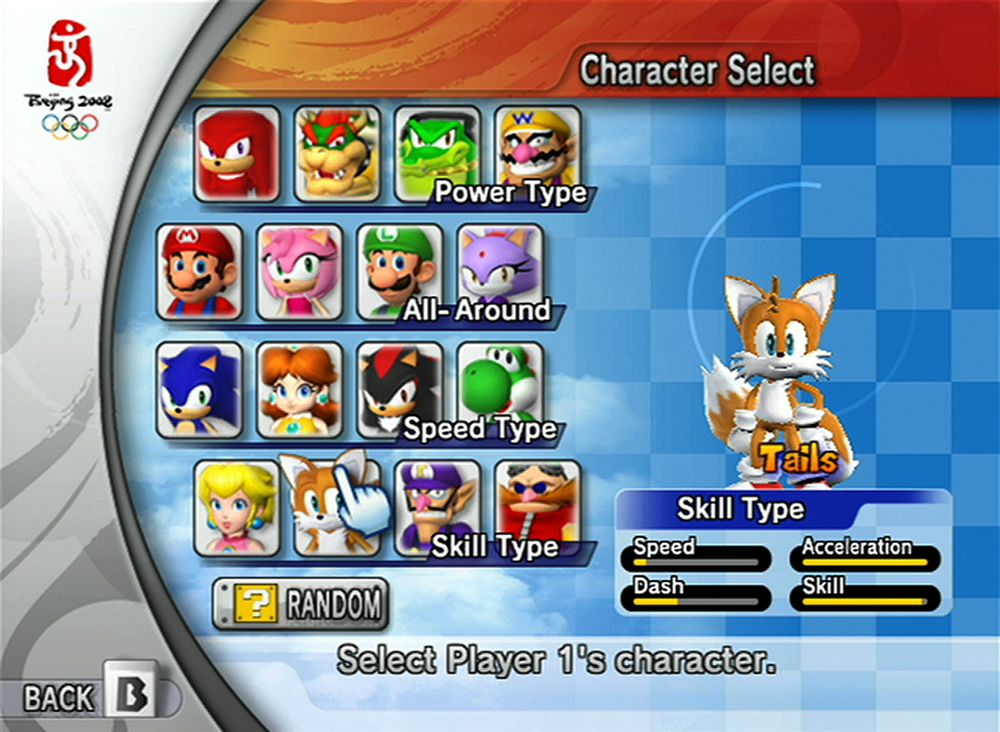

Task 004
=============

# Before
1. cd C:\Users\Tina\Desktop\tina
2. http-server
3. http://localhost:8080/task_004

# Topics Covered
- jQuery
- Event Listeners

# Lesson
This lesson is going to be magical.  Why?  Because we are going to build off of the javascript basics we learned in the last lesson, AND we will use jQuery to manipulating the DOM.  

Since we ultimately want to build a Star Wars character selection screen, we need to learn some of the basic which will be needed to do so.  

Let's use a reference for now to invision what we might want to build:



There are two main components of a character selection screen.

The first component of a character selection screen are boxes which contain avatars of our characters.  These avatars can be clicked.  When clicking on the avatars, I would invision the following happening:

- The avatar is highlighted in some way (maybe a border?)
- The main character displayed is changed to match up with the avatar


Let's start with simply building up the HTML document to contain some avatars:
```html
<div class="avatar" data-character="yoshi"></div>
<div class="avatar" data-character="megaman"></div>
<div class="avatar" data-character="samus"></div>
<div class="avatar" data-character="tails"></div>
<div class="avatar" data-character="toad"></div>
<div class="avatar" data-character="sonic"></div>
```

And, let's go ahead and add CSS to make the .avatar class a box with a background image:
```css
.avatar {
  width: 100px;
  height: 100px;
  display: inline-block;
  margin: 10px;
  background-color: gray;
  cursor: pointer;
}

.avatar[data-character="yoshi"] {
  background-image: url("../images/yoshi.png");
}

.avatar[data-character="megaman"] {
  background-image: url("../images/megaman.gif");
}

.avatar[data-character="samus"] {
  background-image: url("../images/samus.png");
}

.avatar[data-character="tails"] {
  background-image: url("../images/tails.gif");
}

.avatar[data-character="toad"] {
  background-image: url("../images/toad.jpg");
}

.avatar[data-character="sonic"] {
  background-image: url("../images/sonic.jpg");
}
```

Notice the new selector we are using:
```css
.avatar[data-character="sonic"]
```
It simple searches all elements that have the class avatar **AND** which also have an attribute of **data-character** set to the string we provide.

Now, let's go ahead and add some extra style to the avatars for when we hover over them.
```css
.avatar:hover {
  border: 2px solid black;
}
```

I know what you are thinking: BUT I WANT TO USE JQUERY!!!

FINE, let's use some jQuery now to bind a click callback to the avatars to do something once the user clicks the avatars.

First, what do we want to accomplish?  Well, we want to show some extra information about our character once the user selects them.  Additionally, we could display the same image, but larger somewhere, but let's keep it simple for now.

To achieve what we want, we are going to hide and show only the specific elements which contain the same data-character which has been selected.  But first, let's add the elements we will need.
```html
<div class="avatar" data-character="yoshi"></div>
<div class="avatar" data-character="megaman"></div>
<div class="avatar" data-character="samus"></div>
<div class="avatar" data-character="tails"></div>
<div class="avatar" data-character="toad"></div>
<div class="avatar" data-character="sonic"></div>

<div id="description">
  <div>
    <h1 data-character="yoshi">Yoshi</h1>
    <h1 data-character="megaman">Megaman</h1>
    <h1 data-character="samus">Samus</h1>
    <h1 data-character="tails">Tails</h1>
    <h1 data-character="toad">Toad</h1>
    <h1 data-character="sonic">Sonic</h1>
  </div>

  <div>
    <span data-character="yoshi">I lay eggs and I am green.</span>
    <span data-character="megaman">I am a badass robot boy</span>
    <span data-character="samus">I am a badass woman in a space suit</span>
    <span data-character="tails">I am a fox</span>
    <span data-character="toad">I am mushroom</span>
    <span data-character="sonic">I am a blue hedgehog.</span>
  </div>
</div>
```

The final steps is to start writing the jQuery click listener.  What do we need to do?  First, we need to listen for whenever an element with the class .avatar is clicked.  Once it is clicked, we need to hide everything on the screen which doesn't have a data-character of the one selected.  To be specific, let's say the user clicks "yoshi".  In this case, we need to find all elements inside the .description div which DO NOT contain a data-character="yoshi" and hide them.

The javascript:
```javascript
$(document).ready(function() {
  $('.avatar').click(function () {
    // Get the character of what was clicked
    var character = $(this).data('character');

    // Hide any span or h1 elements
    $('#description span, h1').hide();

    // Show only elements that contain the corresponding data-character
    // of the one we clicked
    $('#description [data-character="' + character + '"]').show();
  });
  // Click the first avatar when the page loads
  $('.avatar').get(0).click();
});
```

Now, I will stop here because there is a lot of new stuff that got introduced in this lesson.  

**First**, we used jQuery to bind a function to be invoked whenever the .avatar class is clicked.  By simply reading the code left to right, it should be intuative that when '.avatar' is clicked, it will executed the function we passed into the click function.

**Second**, once the user clicks the .avatar, our click function will be invoked.  We first need to figure out which character was selected:
```javascript
var character = $(this).data('character');
```
This line grabs us the value of the data-character attribute.  We will use this to show the correct elements later on.

**Third**, we simply hide everything.  In this case, we hide all the span, h1 elements which can be found inside the #description element.

**Fourth**, we show the elements which correspond to the .avatar we clicked.

**Finally**, we click programmically click the first .avatar.  This will make it yoshi is selected by default.

# Task
Display a larger and different image from what the avatar is above the title (that is, the h1 tag) when the avatar of that character is clicked.  
